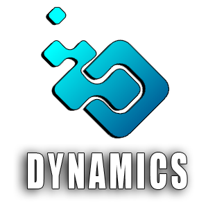

<p align="center">  </p>

O projeto consiste no desenvolvimento de uma solução inteligente focado no cadastramento de produtos, um motor de regras para promoções e vínculo dos mesmos dentro da plataforma.


<h2 align="center">Sistema 👨🏻‍💻 em progresso...</h2>


<h2>Tópicos 🏁</h2>  

<p>
<a href="#rodando-o-projeto">Rodando o Projeto</a> •
<a href="#entregas-">Entregas</a> •
<a href="#product-backlog-">Product Backlog</a> •
<a href="#features-">Features</a> •
<a href="#backlog-em-story-cards-">Backlog em Story cards</a> •
<a href="#pm-canvas-">PM Canvas</a> •
<a href="#tecnologias-">Tecnologias</a> •
<a href="#wireframes-">Wireframes</a> •
<a href="#cronograma-">Cronograma</a> •
</p>


## Rodando o Projeto

<h3>Instalação</h3>  


- Necessário instalar [Java 11+sdk](https://www.oracle.com/java/technologies/javase/jdk11-archive-downloads.html)
- Necessário instalar [Maven](https://maven.apache.org/download.cgi/)
- Necessário instalar [Quarkus](https://quarkus.io/)
- Necessário instalar [JDBC Driver do SQL Server](https://docs.microsoft.com/pt-br/sql/connect/jdbc/download-microsoft-jdbc-driver-for-sql-server)


<h3>🎲 Como usar</h3>  


- Clone este repositório ou baixe-o.
- Descompacte o zip e coloque a pasta do projeto onde desejar.
- Abra o Terminal ou Windows Power Shell.
- Utilize o "cd" e entre na pasta do projeto.
- Ainda no terminal digite o seguinte comando:
```bash
mvn quarkus:dev
```


## Entregas 💎


O planejamento e o progresso durante as Sprints do projeto poderá ser visto em [Entregas](https://github.com/TudoDigital/Dynamics/wiki/Entregas)
<br>

## Product Backlog 📝 

<a href="https://github.com/TudoDigital/Dynamics/projects/1#column-18423006" target="_blank"></a>

<a href="https://github.com/TudoDigital/Dynamics/projects/1#column-18231431" target="_blank"></a>

<a href="https://github.com/TudoDigital/Dynamics/projects/1#column-18444381" target="_blank"></a>


## Features 📚


✔️ Vínculo da promoção com o produto  
✔️ PM Canvas  
✔️ Diagramas de Entidade e Relacionamento   
✔️ Servidor de banco de dados online  
✔️ Diagrama de Classes  
✔️ Previsões das próximas sprints...


## Backlog em Story cards 🧮 


<a href="https://github.com/TudoDigital/Dynamics/projects/2" target="_blank"></a>


## Tecnologias 🖥


<div style="display: inline_block"><br>
  
  
  
  
  
  
  
  
  
</div>
 
## PM Canvas ✒ 


## Wireframes 🎨


  

  
 

## Burndown 📉


## Cronograma 📅


| Data | Evento |
| -------| --------- |
| 14/03 a 18/03 | Project kick-off. |
| 25/03 a 17/04 | [Sprint 1](https://github.com/TudoDigital/Dynamics/tree/sprint-1). |
| 25/04 a 15/15 | [Sprint 2](). |
| 16/05 a 05/06 | [Sprint 3](). |
| 29/11 a 05/12 | Apresentação Final. |
| 15/06 às 19h | Feira de Soluções. |


  
  
 
